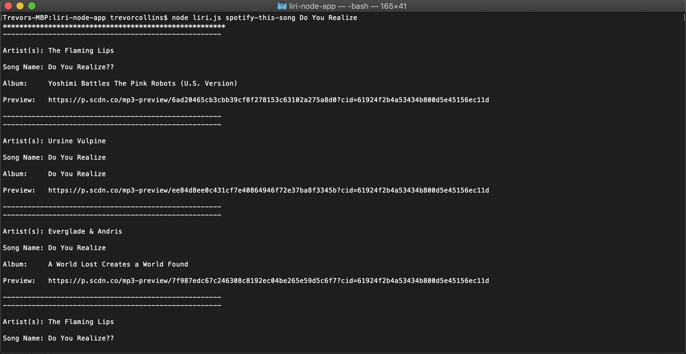
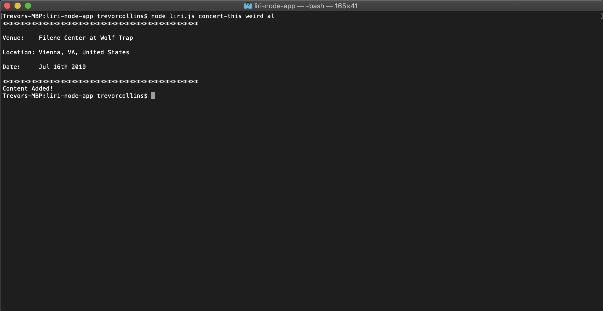
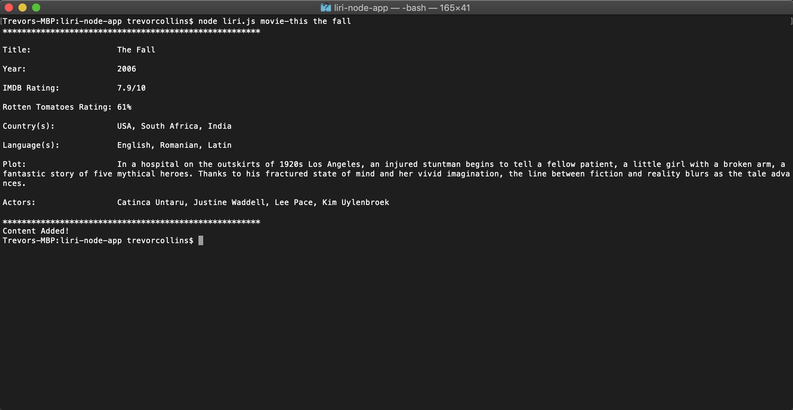
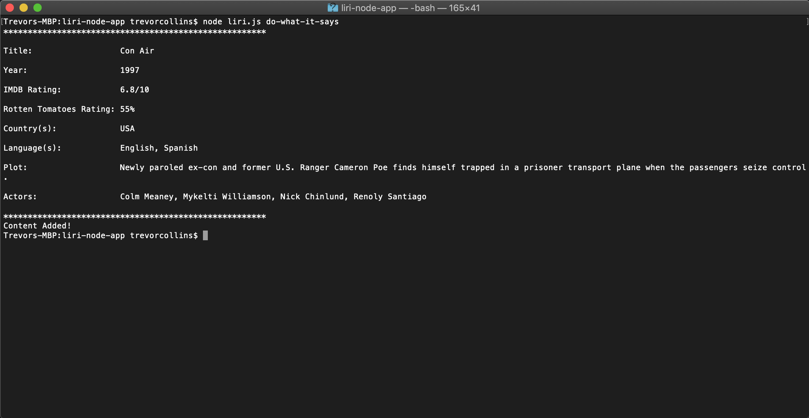

# LIRI (or Language Integrated Response Interface)

LIRI is a CLI app that takes in simple commands and returns parsed info from various api's.

## How to use?

Once you've navigated to the liri-node-app in your terminal, type in "node liri.js" followed by the command and the query you'd like to use.

#### Commands

* spotify-this-song
    * Follow this by the song title to return the top five results from Spotify.
    * You'll see the:
        * Artist or artists
        * Song title
        * Album title
        * Url of a 30 second preview of the song
    * If you don't enter a song name, it will return results for the song "The Sign" by Ace of Base
* concert-this
    * Follow this by the name of a touring artists.
    * You'll see the:
        * Venue name
        * Venue location
        * Date of the concert
* movie-this
    * Follow this by the name of a movie.
    * You'll see the:
        * Movie titile
        * Year of release
        * IMDB rating
        * Rotten Tomatoes rating
        * Countries it was released in
        * Languages it was release in
        * Plot synopsis
        * Actresses and Actors
    * If you don't enter a movie name, it will return results for the song "Mr. Nobody"
* do-what-it-says
    * Don't follow this by anything
    * This will read the random.txt file to pull a command and query

## APIs Used

* Spotify
* Axios
    * OMDB
    * Bands In Town
* FS
* Moment
* Dotenv

## Video / Screenshots

Here is a link to a video demo:
[Video Demo](https://youtu.be/W0-Kg1dPW1k)

<<<<<<< HEAD
Spotify api in action

Bands in Town api in action

OMDB api in action

FS api in action

=======

>>>>>>> d534c2d04100230a92f530b5b33a3ba78611c784
